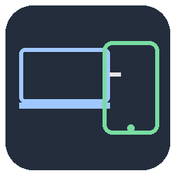

# iPad Extended Display

A small GNOME utility that turns a spare iPad into a real **extended
display** for a Linux desktop, streamed over [Moonlight](https://moonlight-stream.org/)
via [Sunshine](https://github.com/LizardByte/Sunshine). It creates a headless
virtual monitor sized to the iPad's panel, positions it next to your real
display, brings up Sunshine, and (optionally) manages a dedicated Wi-Fi
hotspot for the iPad to connect through — all from one small GTK4 window.



## Features

- **Headless virtual display** via Mutter's `org.gnome.Mutter.ScreenCast`
  D-Bus API — no physical monitor, dummy HDMI plug, or kernel DRM device
  required.
- **Configurable size and position** — presets (including the iPad Mini's
  native 1024×768 @ 60 Hz panel), a custom width/height option, and
  left-of/right-of placement relative to your main display.
- **One-click Sunshine relaunch** — restarts Sunshine and clears its cached
  screen-share permission on every start, so GNOME's screen-recording picker
  is forced to prompt again and the new virtual display shows up as
  selectable.
- **Optional Wi-Fi hotspot management** — brings up a dedicated access point
  for the iPad on Start (useful when it isn't on your regular network) and
  tears it down again on Stop, restoring your normal connection.
- Ships as a **self-contained AppImage** — no installation, no dependency
  management on the user's end beyond what's listed below.

## Requirements

- Linux with **GNOME/Mutter** (uses Mutter's ScreenCast and DisplayConfig
  D-Bus interfaces, and `gdctl` for monitor placement).
- [**Sunshine**](https://github.com/LizardByte/Sunshine), installed as a
  Flatpak (`dev.lizardbyte.app.Sunshine`).
- [**Moonlight**](https://moonlight-stream.org/) installed on the iPad (from
  the App Store), to connect to Sunshine.
- **NetworkManager** (`nmcli`) if you want the built-in Wi-Fi hotspot
  management; safe to leave disabled otherwise.
- Python 3 with **PyGObject** (`gi`), GTK 4, and GStreamer with the PipeWire
  plugin — already satisfied if you run the packaged AppImage, since it only
  depends on system libraries that ship with a GNOME desktop.

## Usage

Download the AppImage from [Releases](../../releases), make it executable,
and run it:

```bash
chmod +x iPad-Extended-Display-*.AppImage
./iPad-Extended-Display-*.AppImage
```

In the window:

1. Optionally enable the Wi-Fi hotspot and set an SSID/password.
2. Pick a display size (or choose "Custom" for a one-off resolution).
3. Pick a position relative to your main display.
4. Click **Start**. Sunshine launches (or restarts) automatically.
5. Pair and connect from Moonlight — see [docs/SETUP.md](docs/SETUP.md) for
   the full walkthrough, including hotspot pairing and matching Moonlight's
   resolution to the virtual display.
6. Click **Stop**, or close the window, to tear everything back down.

Settings (hotspot credentials, saved sizes, last-used position) persist in
`~/.config/ipad-extended-display/`.

## Building from source

```bash
./build.sh
```

Requires `appimagetool` on `PATH` or at
`~/.local/bin/appimagetool-x86_64.AppImage`. This rebuilds the AppImage from
`ipad_extended_display.py` and installs it to `~/Applications`.

## How it works

Mutter's virtual displays have no real kernel DRM device behind them, so
Sunshine's default capture backend can't see them — only its `portal`
capture backend can, and that backend caches the GNOME screen-share consent
it was granted for a specific display. Since the virtual display is
re-created from scratch on every Start, this tool clears Sunshine's cached
portal token and Flatpak permission grant before relaunching it, forcing
GNOME's screen-share picker to prompt again so the current virtual display
can be selected.

Monitor placement is applied via `gdctl set` shortly after the virtual
display is created (polled until Mutter registers it), since the
ScreenCast API itself has no placement option and Mutter auto-places new
monitors on its own.

## License

[MIT](LICENSE) — see the LICENSE file for details.
